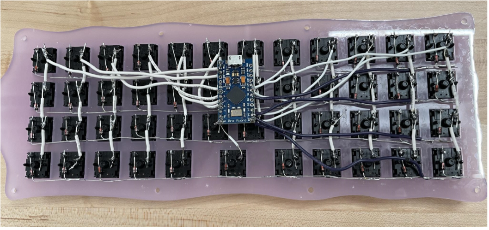

## Introduction

I have been interested in mechanical keyboards for a few years, and I have built a few previously. However, I wanted to try to create a keyboard from scratch, using my college's Makerspace and the $200 student funding allocation. This project uses [Christopher Swenson's tutorial](https://medium.com/@cglyph/how-to-build-a-40-keyboard-102b81fbf508) and takes inspiration from [Qlavier's ditto keyboards](https://www.qlavier.com/).

## Process

First, I had to plan out the case files. I used an online keyboard case generation website to generate a 40% keyboard case, as outlined in the tutorial above, to use as the baseline for the files. Then, I edited them in Adobe Illustrator to be the shape of a Ditto (one of my favorite Pokémon).

Example of a generated file:

Image of the stacked final layers with the inside of the top layer (including all the inside layers would make this picture hard to look at):

And what Ditto normally looks like:

I also used Illustrator to trace the official Ditto art for the face part of the files.

Then, I proceeded to laser cut each file into a layer of acrylic. I bought my acrylic from Delvie's Plastics, which I would recommend. They have a beautiful color selection and were flexible with the dates that I needed the package to arrive on. I bought 3 12'' x 12'' sheets of ColorHues Cast Acrylic Sheet in Wisteria. Less than 2 sheets would have been enough but I was thankful to have the extra acrylic for when I (inevitably) needed to recut something, though I still haven't used the third sheet. 

Before using the laser cutter to cut out each individual layer, I used a bandsaw to cut each acrylic sheet in half before laser cutting. If you don't have access to something that can cut the acrylic, I would make sure you get a size that can fit comfortably in your laser cutter. The layers looked like this stacked on top of each other after laser cutting: 

I'm happy that I did not choose an entirely opaque acrylic, as I like the resulting effect.

Now that I had primarily finished the case, I could begin to work on the electronic aspect of the keyboard. Each key of the keyboard has a switch that is typically soldered into a PCB, however, I decided to hand-wire the switches together to a Microcontroller for fun. This process is also outlined in a lot more detail in the tutorial. 

This project did cost me just under 200 dollars, but this is probably where I could have saved more money if nessesary. I got Gateron Oil King switches which are not a budget option but felt right for this project as I had extra room in the budget and didn't enough time to sit down and lube switches before the deadline (Oil Kings can go without lubing and still sound and feel pretty good).

First I put in the switches into the acrylic: 

 

I wish I had recut this piece since my switches didn't quite pop in to the sockets (the holes were slightly too big), but I assumed that it would be fine since they were currently staying in. That wasn't a great idea, as having to move around the keyboard when soldering caused them to jump out of place. I had problems with them popping out this whole process which was impossible to completely fix as I could only use a new "plate" if I was going to restart the soldering process entirely. 

Next, I soldered the diodes to the left pins of each switch across each row and then wires to the right pins of each switch to connect the columns:

Finishing up the soldering, the micro controller needs to be connected to each row and column:

I added USB to USB C adapter so it can more easily be connected to a computer. However, I wish I made it more subtle or a different color as it looks kind of odd poking out of the back. My friend also had to use a Dremel to shave down the end of the adapter so it would fit, which felt like it could have been avoided has I bought something else. 

The only thing left to do is assemble the keyboard! I originally planned for there to be 8 screws, but I ended up dropping down to just 2 (only recut the top layer to hide the old holes). That is because I was worried the layers were too brittle and small to handle all 8 screws and it didn't seem entirely aligned even though it should have been (printing may not have been as precise as it needed to be?)

Here's an image of the final keyboard! Although I think I would have done some things again differently if I were to redo it, overall I think it turned out pretty good. I was also gifted a Ditto keycap, which really completed the piece!

